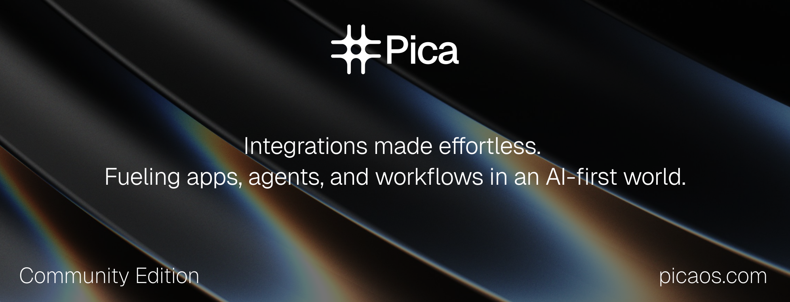

<p align="center">
  <a href="https://picaos.com">
    
  </a>
</p>

<p align="center"><b>Pica Community Edition</b> - <i>Ensuring outcomes for the AI-first world</i></p>

<p align="center">
  <b>
    <a href="https://www.picaos.com">Website</a>
    ·
    <a href="https://docs.picaos.com">Documentation</a>
    ·
    <a href="https://app.picaos.com">Dashboard</a>
    ·
    <a href="https://docs.picaos.com/changelog">Changelog</a>
    ·
    <a href="https://x.com/picahq">X</a>
    ·
    <a href="https://www.linkedin.com/company/picahq">LinkedIn</a>
  </b>
</p>

---

> **Note:** This repository is the **Community Edition** of Pica and is no longer actively maintained. Pica has transitioned to a private, cloud-hosted platform with the latest features and updates. For the most up-to-date experience, visit **[app.picaos.com](https://app.picaos.com)**.

---

Connect your AI agents to 200+ integrations and 25,000+ actions with Pica's managed cloud platform. Secure authentication, verified action knowledge, and developer-friendly SDKs — all managed for you at **[app.picaos.com](https://app.picaos.com)**.

# Getting Started

Get up and running with Pica in minutes.

## What we'll do:

1. Install the Pica CLI
2. Connect your Gmail account
3. Install the Pica Skill

## Step 1: Install the Pica CLI

Install the Pica CLI globally:

```bash
npm i -g @picahq/cli
```

Then initialize Pica to configure and connect it to your environment:

```bash
pica init
```

**Note:** You'll need your Pica secret key from the dashboard: [Get API Key](https://app.picaos.com/settings/api-keys)

## Step 2: Connect your Gmail account

Connect your Gmail account so you can start interacting with it through your agent.

[**Add Gmail Connection →**](https://app.picaos.com/connections)

## Step 3: Install the Pica Skill

Install the Pica skill to give your agent access to all your connected integrations:

```bash
npx skills add https://github.com/picahq/skills --skill pica
```

From here, whatever AI agent or agent builder you're using can connect to the integrations you've set up in your Pica account via the MCP server. Ask your agent to interact with Gmail — or any of the 200+ platforms available on Pica.

---

## Learn More

**[picaos.com](https://www.picaos.com)** — Learn about the Pica platform

**[docs.picaos.com](https://docs.picaos.com)** — Read the documentation

**[app.picaos.com](https://app.picaos.com)** — Sign up and manage your connections, integrations, and agents

